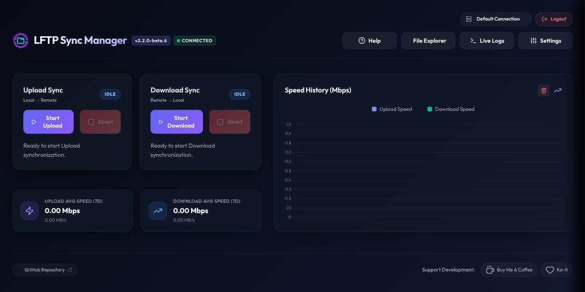

# LFTP Sync Manager

[](https://hub.docker.com/r/cj0r/lftp-sync-manager)
[](https://hub.docker.com/r/cj0r/lftp-sync-manager)
[](LICENSE)
[](https://hub.docker.com/r/cj0r/lftp-sync-manager)

`lftp-sync-manager` is a sleek, web-based control panel and automation manager for `lftp` transfers. It provides a modern Web GUI to orchestrate and monitor fast, multi-segmented, parallel file transfers (Push/Pull) over SFTP, complete with real-time file-watching and cron schedules.



> [!WARNING]
> This software is provided **as is, with no warranty, and is used entirely at your own risk**. It transfers and — depending on your settings — **permanently deletes files** on both your local machine and the remote host. Test with **Dry Run Mode** first and keep backups of anything irreplaceable. Please read [Security Considerations](#-security-considerations) and the [Disclaimer](#%EF%B8%8F-disclaimer--use-at-your-own-risk) before deploying.

---

## 🚀 Key Features

* **Sleek Web GUI**: Real-time progress bars, speed calculations (Mbps/MBs), log viewers, and 30-day transfer speed graphs.
* **High-Performance Transfers**: Leverages `lftp`'s powerful capabilities including segmented downloads (`nsegment`), parallel file queues (`nfile`), and automatic reconnects.
* **Multi-Profile Connections**: Configure multiple independent SFTP connection profiles (different hosts, credentials, and sync settings) and switch the active one directly from the header — no need to re-enter details when syncing to more than one destination.
* **Secure Web Access**: Optional password-protected login screen with TOTP-based Multi-Factor Authentication (compatible with Google Authenticator and similar apps), plus rate-limited login attempts.
* **SSH Key Handshake Tool**: Automatically generates SSH RSA keypairs and installs the public key to your remote SFTP host's `authorized_keys` file directly from the Web UI—eliminating the need to store passwords in your configuration files.
* **Real-Time Push Sync**: Watches a local directory using `chokidar` and automatically uploads new/modified files to the remote server instantly. The watcher respects your exclude filters, so partial or in-progress files (e.g. `*.part`, `*.!qB`) never trigger a sync.
* **Cron-Scheduled Syncs**: Run push or pull operations automatically at specific intervals using standard cron expressions.
* **Connection-Rate Protection**: If a sync fails, automatic retriggers (scheduler and watcher) back off for 30 minutes instead of repeatedly hammering a rate-limited or soft-banned remote host. Manual syncs are never blocked.
* **Pause & Abort Active Syncs**: Freeze a running Push or Pull sync in place (no lost progress) and resume it later, or cancel it outright — pausing also holds off that direction's cron schedule until you resume.
* **File Explorer with Per-Item Transfers**: Dual-pane local/remote browser — push a single local file/folder or pull a single remote one on demand, without running a full directory sync. Transfers show live per-file progress, speed and ETA alongside your syncs, and can be paused, resumed or aborted mid-flight (aborting a batch skips its remaining items). Multi-select with batch push/pull/delete, click-to-sort columns, a name filter, and rename support round out both panes.
* **Webhook & Event Notifications**: Get alerted on sync success, sync failure, File Explorer transfers, connection cooldowns, and failed login attempts through Discord embeds, Telegram, Gotify, Ntfy, or a custom JSON webhook. Channels are configured per connection profile, each with independent per-event toggles — so one-off manual transfers can be muted separately from automated syncs — plus a built-in Test button. Delivery outcomes are written to the sync log, so a channel that stops working says so instead of failing silently.
* **Readable Logs with Raw Fallback**: The live log view is filtered down to what actually matters (transfers, errors, sync summaries) with a one-click toggle to the full raw `lftp` output. Complete unfiltered logs are always written to disk regardless of the view setting, and SFTP passwords are masked everywhere before anything is logged or displayed. A separate "download redacted log" button additionally strips your host and username, so logs are safe to share when asking for help.
* **Bandwidth Throttling & Scheduling**: Restrict download and upload speeds (in KB/s) either globally or on a custom schedule (time-of-day and day-of-week) to preserve network capacity.
* **Wildcard Include/Exclude Filters**: Fine-tune transfers by specifying comma-separated glob patterns (e.g., `*.tmp`, `*.mkv`) to target only the files you want.
* **Advanced Sync Options**: Fine-grained transfer options including Delete Target Files (true mirroring), Dry Run Mode, Ignore Modification Time, and Only Sync Missing Files.
* **Installable PWA**: Installable as a standalone app on desktop and mobile (Add to Home Screen) for quick access without a browser tab.
* **Unraid Optimized**: Easily deploys on Unraid servers or any standard Docker daemon.

---

## 🛠️ Docker Quickstart

The easiest way to run `lftp-sync-manager` is using Docker or Docker Compose.

### Option 1: Docker Compose (Recommended)

1. Download the sample [compose.yaml](compose.yaml) file.
2. Open the file and edit the volume host paths (`/path/to/local/...`) to point to your desired configuration and storage directories on your system.
3. Run the container in detached mode:
   ```bash
   docker compose up -d
   ```

### Option 2: Docker Run CLI

```bash
docker run -d \
  --name=lftp-sync-manager \
  -p 9342:9342 \
  -v /path/to/appdata/config:/config \
  -v /path/to/local/upload:/local-push \
  -v /path/to/local/download:/local-pull \
  --restart unless-stopped \
  cj0r/lftp-sync-manager:latest
```

---

## ⚙️ Directory Volume Mappings

| Container Path | Host Path Recommendation | Description |
| :--- | :--- | :--- |
| `/config` | `/mnt/user/appdata/lftp-sync-manager` | Houses the `config.json`, SSH keys (`id_rsa`/`id_rsa.pub`), history database, and logs. |
| `/local-push` | `/mnt/user/share/upload` | Files placed here are pushed/uploaded to the remote host. |
| `/local-pull` | `/mnt/user/share/download` | Target directory where remote files are pulled/downloaded. |

---

## 📖 Step-by-Step Configuration Guide

Once your container is running, navigate to `http://<your-server-ip>:9342` in your browser to access the Web GUI. Follow these steps to configure your synchronization tasks.

### Step 1: Set Up Connection Details
1. Go to the **Settings** tab.
2. Enter your SFTP remote host details:
   * **Host**: The domain name or IP address of your remote SFTP server (e.g. `sftp.example.com` or `192.168.1.100`).
   * **Port**: The port used for SSH/SFTP (default is `22`).
   * **Login**: The username of the remote account.
   * **Password**: The password for the remote account. *(Note: This password is only needed temporarily if you plan to configure the SSH Handshake tool).*

---

### Step 2: Establish SSH Key Authentication (Highly Recommended)
Using SSH key pairs is the most secure method of file transfer and removes the need to store passwords in your application.

```
       [ lftp-sync-manager Web GUI ]
                    │
     1. Click "Generate SSH Keys"
                    │
     2. Click "Authorize SSH Key"
                    │
     ┌──────────────┴──────────────┐
     │ (Logs in using password)    │
     │ - Downloads authorized_keys │
     │ - Appends new public key    │
     │ - Uploads updated keys      │
     └──────────────┬──────────────┘
                    │
     3. Password is deleted from config
     4. Subsequent syncs use /config/id_rsa
```

1. In the **Settings** tab, scroll to the **SSH Configuration** section.
2. Click **Generate SSH Keys**. This creates a secure 4096-bit RSA keypair inside your `/config` volume (`/config/id_rsa` and `/config/id_rsa.pub`).
3. Enter your remote connection details (Host, Username, and Password) and click **Authorize SSH Key**.
4. The system will connect to the remote host, check if a `.ssh/` folder exists, fetch the existing `.ssh/authorized_keys` file, append your public key, upload it, and set secure `600` permissions.
5. Once authorization succeeds, the application **automatically deletes the password** from the configuration file. All future connections will use `/config/id_rsa`.

---

### Step 3: Configure Transfer Tuning, Filters, & Bandwidth Throttling (Optional)
Configure limits, filtering, and concurrency settings to optimize network throughput:
* **Max Parallel Files (`nfile`)**: The maximum number of files `lftp` will transfer simultaneously.
* **Max Segments (`nsegment`)**: The number of concurrent connections per file. Setting this to `8` or `16` speeds up transfers over high-latency networks.
* **Min Chunk Size (`minchunk`)**: The minimum chunk size (in megabytes) required to trigger segmented transfers.
* **Bandwidth Limits**: Toggle throttling and set maximum Download and Upload limits (in KB/s). Optionally set a time window (e.g., `08:00` to `17:00`) and choose the active days of the week to throttle.
* **Wildcard Filters**: Specify glob patterns to exclude (e.g., `*.tmp`, `Thumbs.db`) or to exclusively include (e.g., `*.mp4`, `*.mkv`) files from the transfers.
* **Mirror Options**: Turn on advanced flags:
  * **Delete Target Files**: Removes files on the destination if they no longer exist on the source (true mirroring).
  * **Dry Run Mode**: Executes the sync task but only logs what would be transferred (without writing any files).
  * **Ignore Modification Time**: Matches files by presence and file size only, skipping the timestamp comparison.
  * **Only Sync Missing Files**: Prevents overwriting any existing files on the destination.

---

### Step 4: Configure Sync Tasks

#### ⬆️ Push Configuration (Local to Remote)
1. **Remote Destination Directory**: Specify where files uploaded from `/local-push` should be stored on the remote host (e.g., `/home/username/uploads`).
2. **Real-time Watching**: Check this box to enable instant transfers. Any file modified, added, or moved to `/local-push` will trigger an automated push sync.
3. **Cron Schedule**: Enable this and set a cron schedule expression (e.g. `*/30 * * * *` for every 30 minutes) to perform periodic sweeps.

#### ⬇️ Pull Configuration (Remote to Local)
1. **Remote Source Directory**: Specify the directory on the remote host containing files you want to retrieve (e.g., `/home/username/downloads`).
2. **Cron Schedule**: Enable this and write a cron schedule expression (e.g. `0 2 * * *` for daily at 2:00 AM) to pull new files.

Click **Save Config** at the bottom of the page to apply your settings and start schedulers.

---

### Step 5: Set Up Notifications (Optional)

In **Settings → Notification Channels**, click **Add Channel** and pick a type:

| Type | What you'll need |
| :--- | :--- |
| **Discord** | A channel Webhook URL (Channel Settings → Integrations → Webhooks) |
| **Telegram** | A bot token from [@BotFather](https://t.me/BotFather) and your chat ID |
| **Gotify** | Your server URL and an application token |
| **Ntfy** | Your server URL (e.g. `https://ntfy.sh`) and a topic name |
| **Custom Webhook** | Any URL that accepts a JSON `POST` |

Each channel has its own toggles, so you control exactly what it tells you:

* **Sync Success / Sync Failure** — scheduled and manual full syncs.
* **Explorer Transfer / Explorer Failure** — one-off per-item transfers from the File Explorer. Kept separate so manual transfers can be muted independently of automated syncs.
* **Cooldown Activated** — a sync failed and automatic retries are backing off for 30 minutes.
* **Auth Alert** — a failed login attempt on the web UI.

Use the **Test** button to confirm a channel works before relying on it. Channels are saved per connection profile, so different remotes can notify different places.

> **Note:** a successful sync that transferred nothing is intentionally silent, so routine scheduled sweeps don't generate noise. Delivery outcomes are recorded in the sync log (`[Notifications] …`), so if a channel ever stops working you can see why without digging through container logs.

---

## 🔐 Security Considerations

This app holds credentials for a remote server and can move and delete files on both ends. Please read this section before exposing it beyond your local network.

### Do not expose this container directly to the internet

Put it behind a reverse proxy (Nginx Proxy Manager, Traefik, Caddy, Cloudflare Tunnel/Access, etc.) with TLS, and ideally an additional authentication layer in front.

**Specifically**: the app sets `app.set('trust proxy', 1)`, meaning it trusts the `X-Forwarded-For` and `X-Forwarded-Proto` headers from exactly one upstream proxy hop. That is the correct setting for the normal "Docker container behind a reverse proxy" deployment, and it's what makes rate limiting and the `Secure` cookie flag work correctly through that proxy.

If the container is reachable **directly** from the internet with no proxy in front, a client can forge those headers — spoofing `X-Forwarded-For` to defeat the login rate limiter (making password/MFA brute force viable), and `X-Forwarded-Proto` to influence the session cookie's `Secure` flag. If you must run it without a reverse proxy, remove the `app.set('trust proxy', 1)` line in `server.js` before doing so.

### Enable authentication (and MFA)

Web authentication is **optional and off by default**, so a fresh instance is unauthenticated. Anyone who can reach the port can read your credentials and trigger transfers. Turn on **Settings → Web Security & Authentication**, set a strong password, and enable TOTP MFA if the instance is reachable from outside your LAN.

### Prefer SSH keys over stored passwords

Use the SSH Key Handshake tool (Step 2 above). Once authorized, the app deletes the stored SFTP password from its config and authenticates with `/config/id_rsa` instead.

### What's stored in `/config`, and how

`config.json` contains your session-signing key, your MFA secret, and (if you haven't switched to SSH keys) your SFTP password in plaintext. The app writes it with `0600` permissions and tightens existing files on startup, and `/config/id_rsa` is written `0600` as well.

Treat the `/config` volume as sensitive: don't place it on a world-readable share, don't commit it to a repo, and exclude it from backups that are stored or synced somewhere less protected than the server itself.

### Credentials are never sent to the browser

Stored secrets — your SFTP password, MFA secret, and notification credentials (Discord webhook URLs, Telegram bot tokens, Gotify app tokens, ntfy topics, custom webhook URLs) — are replaced with a `••••••••` placeholder in every response the server sends to the browser. They stay on the server.

In the settings form this means a saved credential shows as `••••••••`. Leave the field alone to keep the stored value, click into it and type to replace it, or clear it to remove it. **Test Connection**, **Authorize SSH Key**, and a channel's **Test** button all resolve the placeholder back to the real secret server-side, so you never have to re-type a credential just to test it.

### Logs

Passwords are masked in logs automatically. Host and username are **not** masked in the normal view, since you need them for troubleshooting — use the **Download Redacted Log** button (shield icon in the Live Logs panel) when sharing logs publicly, which replaces both with `[host]` and `[user]`.

---

## ⚠️ Disclaimer — Use at Your Own Risk

**This software is provided "as is", without warranty of any kind, express or implied.** See the [LICENSE](LICENSE) file for the full legal text.

In plain terms:

* **You use this software entirely at your own risk.** The author and contributors accept no responsibility or liability for any data loss, corrupted or deleted files, service interruption, exposed credentials, security incidents, bandwidth or storage costs, remote-host account suspensions or bans, or any other damages arising from the use or misuse of this software.
* **This tool deletes files.** Options like *Delete Target Files* (`--delete`), the push sync's remove-source-after-upload behavior, and the File Explorer's delete actions permanently remove data on your local machine and/or remote host. **Test with Dry Run Mode enabled first**, and keep independent backups of anything you cannot afford to lose.
* **Verify your configuration before running it against real data.** Misconfigured source/destination directories, filters, or mirror flags can delete or overwrite far more than intended. The author cannot recover data lost this way.
* **You are responsible for your own deployment security** — network exposure, authentication, TLS, reverse-proxy configuration, credential hygiene, and access to the `/config` volume are all your responsibility. See [Security Considerations](#-security-considerations) above.
* **You are responsible for complying with the terms of service** of any remote host, seedbox, or provider you connect to, and with all applicable laws regarding the content you transfer.

This is a hobbyist project maintained on a best-effort basis. It is not a commercially supported product, carries no uptime or support guarantee, and should not be relied upon as the sole safeguard for irreplaceable data.

If you find a security issue, please report it via [Issues](https://github.com/cj0r/lftp-sync-manager/issues) (or privately, if the issue is sensitive) rather than disclosing it publicly.

---

## 🗺️ Roadmap

`v2.5.0` adds the notification engine, a readable log view, a security hardening pass, and full progress/pause/abort control for File Explorer transfers — on top of `v2.4.x`'s File Explorer Overhaul and sync Pause/Resume/Abort, and `v2.2.0`'s Web Authentication + MFA and multi-profile connections. Here's what's next, roughly in build order:

* **File Explorer Overhaul (`v2.4.0`–`v2.4.3`)** — ✅ Complete. Per-item push/pull for a single file or folder shipped in `v2.4.0`; multi-select with batch push/pull/delete, sortable/filterable listings, and rename support for local and remote files/folders shipped in `v2.4.3`.
* **Webhook & Event Notifications (`v2.5.0`)** — ✅ Complete. Multi-channel alerts (Discord embeds, Telegram, Gotify, Ntfy, custom JSON webhooks) on sync success/failure, File Explorer transfers, connection cooldowns, and auth alerts, with profile-scoped channels and independent per-event toggles. Shipped alongside a log readability pass (filtered view with raw toggle, credential masking, redacted export), a full security audit that ended stored credentials ever being sent to the browser, and live progress plus pause/resume/abort for File Explorer transfers.
* **Media Server & Automation Integrations (`v2.6.0`)** — Automatic library rescans on Plex, Jellyfin, Emby, Sonarr, and Radarr after a pull sync completes, plus optional secure post-sync execution hooks for custom scripts.
* **SQLite Database & Analytics (`v2.7.0`)** — Persistent SQLite history replacing the current flat-file log, unlocking per-file transfer history and 7d/30d/90d/1y charts with activity heatmaps.
* **Remote Health Diagnostics (`v2.8.0`)** — Remote SFTP disk capacity monitoring and live latency/socket health indicators per connection profile.

The File Explorer overhaul moved to the front since it's a standalone UI/API addition with no new infrastructure required; media-server integrations come next for the same reason, ahead of the bigger-lift database migration and remote diagnostics. Feedback and feature requests are welcome via [Issues](https://github.com/cj0r/lftp-sync-manager/issues).

---

## ☕ Support the Project

If `LFTP Sync Manager` has simplified your transfers or automated your backups, consider supporting its continued development! Any contribution is highly appreciated.

* [**Buy Me A Coffee**](https://www.buymeacoffee.com/cj0r) — Quick one-time support
* [**Ko-fi**](https://ko-fi.com/cj000r) — Support via Ko-fi with 0% platform fees

[](https://www.buymeacoffee.com/cj0r)
[](https://ko-fi.com/cj0r)

---

## 📄 License

This project is licensed under the PolyForm Noncommercial License 1.0.0. Personal and non-commercial use is free, while commercial use requires a separate agreement. See the [LICENSE](LICENSE) file for details.
