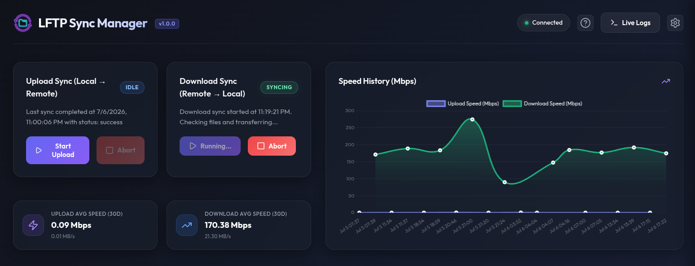

# LFTP Sync Manager

[](https://hub.docker.com/r/cj0r/lftp-sync-manager)
[](https://hub.docker.com/r/cj0r/lftp-sync-manager)
[](LICENSE)
[](https://hub.docker.com/r/cj0r/lftp-sync-manager)

`lftp-sync-manager` is a sleek, web-based control panel and automation manager for `lftp` transfers. It provides a modern Web GUI to orchestrate and monitor fast, multi-segmented, parallel file transfers (Push/Pull) over SFTP, complete with real-time file-watching and cron schedules.



---

## 🚀 Key Features

* **Sleek Web GUI**: Real-time progress bars, speed calculations (Mbps/MBs), log viewers, and 30-day transfer speed graphs.
* **High-Performance Transfers**: Leverages `lftp`'s powerful capabilities including segmented downloads (`nsegment`), parallel file queues (`nfile`), and automatic reconnects.
* **SSH Key Handshake Tool**: Automatically generates SSH RSA keypairs and installs the public key to your remote SFTP host's `authorized_keys` file directly from the Web UI—eliminating the need to store passwords in your configuration files.
* **Real-Time Push Sync**: Watches a local directory using `chokidar` and automatically uploads new/modified files to the remote server instantly.
* **Cron-Scheduled Syncs**: Run push or pull operations automatically at specific intervals using standard cron expressions.
* **Unraid Optimized**: Easily deploys on Unraid servers or any standard Docker daemon.

---

## 🛠️ Docker Quickstart

The easiest way to run `lftp-sync-manager` is using Docker or Docker Compose.

### Option 1: Docker Compose (Recommended)

1. Download the sample [compose.yaml](compose.yaml) file.
2. Open the file and edit the volume host paths (`/path/to/local/...`) to point to your desired configuration and storage directories on your system.
3. Run the container in detached mode:
   ```bash
   docker compose up -d
   ```

### Option 2: Docker Run CLI

```bash
docker run -d \
  --name=lftp-sync-manager \
  -p 9342:9342 \
  -v /path/to/appdata/config:/config \
  -v /path/to/local/upload:/local-push \
  -v /path/to/local/download:/local-pull \
  --restart unless-stopped \
  cj0r/lftp-sync-manager:latest
```

---

## ⚙️ Directory Volume Mappings

| Container Path | Host Path Recommendation | Description |
| :--- | :--- | :--- |
| `/config` | `/mnt/user/appdata/lftp-sync-manager` | Houses the `config.json`, SSH keys (`id_rsa`/`id_rsa.pub`), history database, and logs. |
| `/local-push` | `/mnt/user/share/upload` | Files placed here are pushed/uploaded to the remote host. |
| `/local-pull` | `/mnt/user/share/download` | Target directory where remote files are pulled/downloaded. |

---

## 📖 Step-by-Step Configuration Guide

Once your container is running, navigate to `http://<your-server-ip>:9342` in your browser to access the Web GUI. Follow these steps to configure your synchronization tasks.

### Step 1: Set Up Connection Details
1. Go to the **Settings** tab.
2. Enter your SFTP remote host details:
   * **Host**: The domain name or IP address of your remote SFTP server (e.g. `sftp.example.com` or `192.168.1.100`).
   * **Port**: The port used for SSH/SFTP (default is `22`).
   * **Login**: The username of the remote account.
   * **Password**: The password for the remote account. *(Note: This password is only needed temporarily if you plan to configure the SSH Handshake tool).*

---

### Step 2: Establish SSH Key Authentication (Highly Recommended)
Using SSH key pairs is the most secure method of file transfer and removes the need to store passwords in your application.

```
       [ lftp-sync-manager Web GUI ]
                    │
     1. Click "Generate SSH Keys"
                    │
     2. Click "Authorize SSH Key"
                    │
     ┌──────────────┴──────────────┐
     │ (Logs in using password)    │
     │ - Downloads authorized_keys │
     │ - Appends new public key    │
     │ - Uploads updated keys      │
     └──────────────┬──────────────┘
                    │
     3. Password is deleted from config
     4. Subsequent syncs use /config/id_rsa
```

1. In the **Settings** tab, scroll to the **SSH Configuration** section.
2. Click **Generate SSH Keys**. This creates a secure 4096-bit RSA keypair inside your `/config` volume (`/config/id_rsa` and `/config/id_rsa.pub`).
3. Enter your remote connection details (Host, Username, and Password) and click **Authorize SSH Key**.
4. The system will connect to the remote host, check if a `.ssh/` folder exists, fetch the existing `.ssh/authorized_keys` file, append your public key, upload it, and set secure `600` permissions.
5. Once authorization succeeds, the application **automatically deletes the password** from the configuration file. All future connections will use `/config/id_rsa`.

---

### Step 3: Configure Transfer Tuning (Optional)
Tune how `lftp` handles files and segments to optimize network throughput:
* **Max Parallel Files (`nfile`)**: The maximum number of files `lftp` will transfer simultaneously.
* **Max Segments (`nsegment`)**: The number of concurrent connections per file. Setting this to `8` or `16` speeds up transfers over high-latency networks.
* **Min Chunk Size (`minchunk`)**: The minimum chunk size (in megabytes) required to trigger segmented transfers.

---

### Step 4: Configure Sync Tasks

#### ⬆️ Push Configuration (Local to Remote)
1. **Remote Destination Directory**: Specify where files uploaded from `/local-push` should be stored on the remote host (e.g., `/home/username/uploads`).
2. **Real-time Watching**: Check this box to enable instant transfers. Any file modified, added, or moved to `/local-push` will trigger an automated push sync.
3. **Cron Schedule**: Enable this and set a cron schedule expression (e.g. `*/30 * * * *` for every 30 minutes) to perform periodic sweeps.

#### ⬇️ Pull Configuration (Remote to Local)
1. **Remote Source Directory**: Specify the directory on the remote host containing files you want to retrieve (e.g., `/home/username/downloads`).
2. **Cron Schedule**: Enable this and write a cron schedule expression (e.g. `0 2 * * *` for daily at 2:00 AM) to pull new files.

Click **Save Config** at the bottom of the page to apply your settings and start schedulers.

---

## ☕ Support the Project

If `LFTP Sync Manager` has simplified your transfers or automated your backups, consider supporting its continued development! Any contribution is highly appreciated.

* [**Buy Me A Coffee**](https://www.buymeacoffee.com/cj0r) — Quick one-time support
* [**Ko-fi**](https://ko-fi.com/cj000r) — Support via Ko-fi with 0% platform fees

[](https://www.buymeacoffee.com/cj0r)
[](https://ko-fi.com/cj0r)

---

## 📄 License

This project is licensed under the PolyForm Noncommercial License 1.0.0. Personal and non-commercial use is free, while commercial use requires a separate agreement. See the [LICENSE](LICENSE) file for details.
