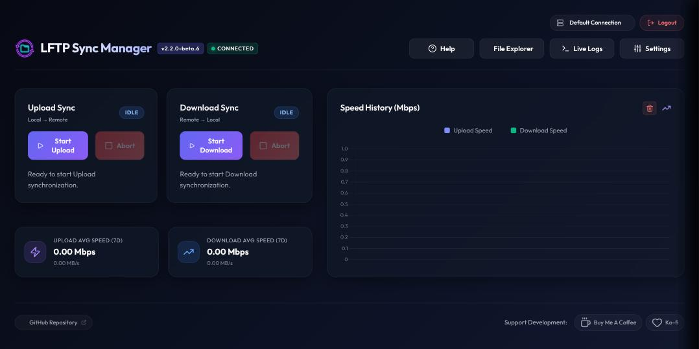
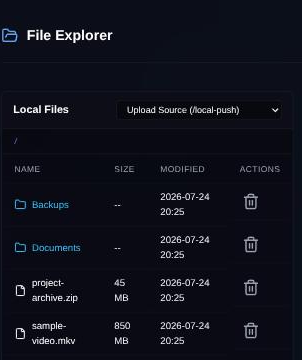
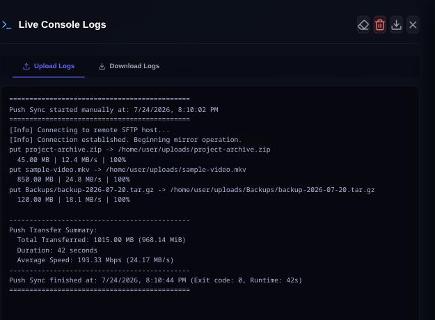
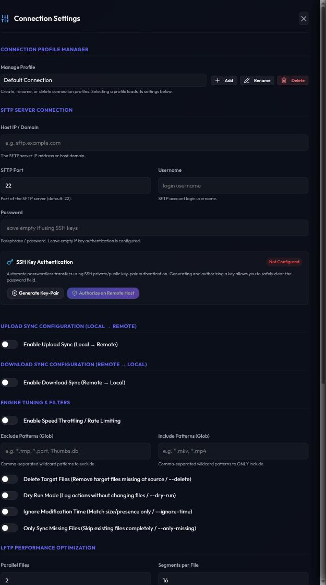
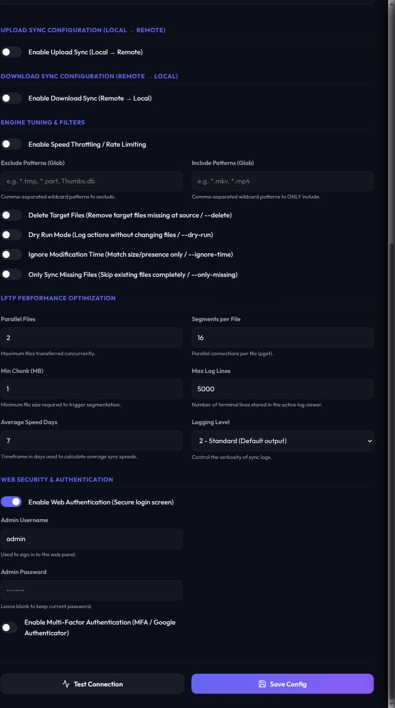

# LFTP Sync Manager

[](https://hub.docker.com/r/cj0r/lftp-sync-manager)
[](https://hub.docker.com/r/cj0r/lftp-sync-manager)
[](LICENSE)

LFTP Sync Manager is a web control panel for `lftp`. It pushes files from a local folder to an SFTP server and pulls them back down, using `lftp`'s segmented, parallel transfers, and runs those syncs on a schedule or the moment a file lands in the folder. It runs as one Docker container with a web UI for settings, live progress, logs and a two-pane file explorer.



> [!WARNING]
> This software is provided **as is, with no warranty, and is used entirely at your own risk**. It transfers and, depending on your settings, **permanently deletes files** on both your local machine and the remote host. Test with **Dry Run Mode** first and keep backups of anything irreplaceable. Read [Security](#security) and the [Disclaimer](#disclaimer) before deploying.

## Features

- Push (local to remote) and pull (remote to local) syncs over SFTP, with `lftp`'s segmented downloads (`nsegment`), parallel file queues (`nfile`) and automatic reconnects.
- Pushes the moment a file is added or changed in the push folder, or on a cron schedule; pulls on a cron schedule. The folder watcher skips files your exclude filters match, so partial downloads (`*.part`, `*.!qB`) never start a sync.
- Several connection profiles (different hosts, credentials and sync settings), switched from the header.
- An SSH key handshake: generate a key pair and install it on the remote host from the web UI, after which the stored password is deleted.
- A file explorer with a local and a remote pane: push or pull one file or folder on demand, multi-select for batch push, pull and delete, sort, filter and rename. Transfers show live progress, speed and ETA, and can be paused, resumed or aborted.
- Pause a running sync in place and resume it later, or abort it. Pausing also holds off that direction's schedule.
- Backs off for 30 minutes after a failed sync instead of hammering a rate-limited or soft-banned host. The backoff applies only to the direction that failed, and manual syncs are never blocked.
- Notifications to Discord, Telegram, Gotify, ntfy or any JSON webhook on sync success or failure, file explorer transfers, a cooldown starting, or a failed sign-in. Channels are set per profile, each with its own event toggles and a Test button.
- Logs filtered down to what matters, with a one-click switch to the full `lftp` output. Passwords are masked everywhere, and a redacted download also hides host and username so a log is safe to share.
- Bandwidth limits, always on or on a time-of-day and day-of-week schedule.
- Include and exclude glob filters, true mirroring (delete on the destination), dry runs, ignore modification time, and only-missing-files.
- Password sign-in with optional two-factor codes (any authenticator app) and rate-limited attempts.
- Installable as an app (PWA) on desktop and mobile. Runs on Unraid or any Docker host.

## Screenshots

| | |
|---|---|
|  |  |
| **File explorer.** Push or pull one item, or a whole selection, between the two panes. | **Live logs.** The filtered view, with the full `lftp` output one click away. |
|  |  |
| **Connection settings.** Host, credentials, SSH keys and transfer tuning per profile. | **Web security.** Password and two-factor sign-in. |

## Quick start (Docker)

1. Get [compose.yaml](compose.yaml) and change the three `/path/to/...` host folders to your own:
   ```bash
   mkdir lftp-sync-manager && cd lftp-sync-manager
   curl -fsSLO https://raw.githubusercontent.com/cj0r/lftp-sync-manager/production/compose.yaml
   ```
2. Start it:
   ```bash
   docker compose up -d
   ```
   This pulls `cj0r/lftp-sync-manager:latest` from Docker Hub, built for `linux/amd64` and `linux/arm64`.
3. Open `http://<host>:9342` from your local network. Until a password is set, the web UI only opens from the local network (see [Sign-in](#sign-in)), so set one first under **Settings → Web Security & Authentication**.
4. Set up a connection (see [Setting it up](#setting-it-up)), run a sync with **Dry Run Mode** on, then for real.

Or with `docker run`:

```bash
docker run -d \
  --name=lftp-sync-manager \
  --init \
  --security-opt no-new-privileges:true \
  -p 9342:9342 \
  -v /path/to/appdata/config:/config \
  -v /path/to/local/upload:/local-push \
  -v /path/to/local/download:/local-pull \
  --restart unless-stopped \
  cj0r/lftp-sync-manager:latest
```

The image has a Docker health check, so Unraid, Portainer, Dockge and `docker ps` show the container as healthy while the web UI answers.

**Updating:** `docker compose pull && docker compose up -d` (or your manager's update button). The `/config` folder carries over.

### Building from source

```bash
git clone https://github.com/cj0r/lftp-sync-manager.git && cd lftp-sync-manager
docker build -t cj0r/lftp-sync-manager:latest .
docker compose up -d
```

### Folders

| Container path | Example host path | What it holds |
| :--- | :--- | :--- |
| `/config` | `/mnt/user/appdata/lftp-sync-manager` | `config.json`, the SSH key pair (`id_rsa`, `id_rsa.pub`), known host keys (`known_hosts`), transfer history and logs. |
| `/local-push` | `/mnt/user/share/upload` | Files placed here are pushed to the remote host. |
| `/local-pull` | `/mnt/user/share/download` | Files pulled from the remote host land here. |

### Environment variables

| Variable | Default | What it does |
| :--- | :--- | :--- |
| `PORT` | `9342` | Port the web UI listens on inside the container. |
| `CONFIG_DIR` | `/config` | Where settings, keys, history and logs are kept. |
| `TRUST_PROXY` | `loopback, linklocal, uniquelocal` | Which reverse proxies may set `X-Forwarded-For` and `X-Forwarded-Proto`. See [Reverse proxy](#reverse-proxy). |
| `ALLOW_REMOTE_WITHOUT_AUTH` | `false` | `true` lets the web UI open from outside the local network without a password. Only for setups where something in front of it already handles sign-in. |

## Setting it up

Open **Settings**. Everything is saved per connection profile when you press **Save Config**, which also starts the schedules.

### Connection

- **Host**, **Port** (usually `22`) and **Login** of the SFTP server.
- **Password**, which you only need until the SSH key is installed (next step).
- **Test Connection** checks the details without saving them.

### SSH key (recommended)

An SSH key means no password is stored at all.

1. Press **Generate Key-Pair**. This creates `/config/id_rsa` and `/config/id_rsa.pub`.
2. With host, login and password filled in, press **Authorize on Remote Host**. The app signs in with the password, adds the public key to the remote `~/.ssh/authorized_keys` (keeping what's there), and sets it to `600`.
3. Once that succeeds the password is deleted from the config, and every connection after that uses the key.

The first connection to a host saves its key in `/config/known_hosts`, and later connections refuse a host whose key has changed. See [Troubleshooting](#troubleshooting) if your provider moves you to a new server.

### Push and pull

- **Push**: the remote folder that files from `/local-push` go to. Turn on **Enable Real-time Upload** to push as soon as something changes, and/or a **Cron Schedule** (for example `*/30 * * * *`, every 30 minutes) for regular sweeps.
- **Pull**: the remote folder to fetch from into `/local-pull`, with its own cron schedule (for example `0 2 * * *`, daily at 2:00).

### Transfer tuning, filters and limits

- **Parallel Files** (`nfile`): how many files transfer at once.
- **Segments per File** (`nsegment`): connections per file. `8` or `16` helps on high-latency links.
- **Min Chunk (MB)** (`minchunk`): the smallest piece a file is split into.
- **Bandwidth limits**: download and upload caps in KB/s, always on or within a time window on chosen days.
- **Filters**: comma-separated globs to exclude (`*.tmp, Thumbs.db`) or to include only (`*.mkv, *.mp4`).
- **Mirror options**: **Delete Target Files** (true mirroring), **Dry Run Mode** (log what would happen, change nothing), **Ignore Modification Time** (compare by name and size) and **Only Sync Missing Files** (never overwrite).

### Notifications

Under **Settings → Notification Channels**, press **Add Channel**:

| Type | What you need |
| :--- | :--- |
| Discord | A channel webhook URL (Channel Settings → Integrations → Webhooks) |
| Telegram | A bot token from [@BotFather](https://t.me/BotFather) and your chat ID |
| Gotify | Your server URL and an application token |
| ntfy | Your server URL (for example `https://ntfy.sh`) and a topic |
| Custom webhook | Any URL that accepts a JSON `POST` |

Each channel picks its events: **Sync Success**, **Sync Failure**, **Explorer Transfer**, **Explorer Failure**, **Cooldown Activated** and **Auth Alert** (a failed sign-in). A sync that transferred nothing sends nothing, so routine sweeps stay quiet. Delivery results are written to the sync log as `[Notifications] ...`.

## Security

This app holds the credentials of a remote server and can delete files on both ends. Read this before opening it up beyond your home network. To report a security problem, see [SECURITY.md](SECURITY.md).

### Sign-in

Web authentication is set under **Settings → Web Security & Authentication**: a username, a password of at least 8 characters, and optionally two-factor codes from any authenticator app.

Until a password is set, the web UI only opens for browsers on your local network that connect to it directly (private and Tailscale addresses). A request through a reverse proxy, or from a public address, gets a page saying to set a password first. If something in front of the app already handles sign-in (Authelia, Cloudflare Access and the like) and you want to keep the app's own sign-in off, set `ALLOW_REMOTE_WITHOUT_AUTH=true`.

Sign-ins last 30 days. Changing the password signs every other browser out. Ten sign-in attempts from one address within 15 minutes lock that address out until the 15 minutes are up.

### Reverse proxy

To reach it from outside your network, put it behind a reverse proxy with HTTPS (Caddy, nginx, Traefik, Nginx Proxy Manager, Cloudflare Tunnel) and set a password.

1. The proxy must pass WebSocket connections through (live progress and logs use one) and keep the original `Host` header, or send `X-Forwarded-Host`.
2. `TRUST_PROXY` decides whose `X-Forwarded-For` and `X-Forwarded-Proto` headers are believed. The default trusts proxies on loopback and private networks, which covers a proxy container on the same Docker network, `cloudflared`, or a proxy elsewhere on your LAN. If your proxy connects from a public address, set `TRUST_PROXY` to that address. Without the right setting, sign-in rate limits apply to the proxy as a whole, and the sign-in cookie isn't marked HTTPS-only.
3. With only the proxy using it, publish the port on the host's loopback address alone (`"127.0.0.1:9342:9342"` in `compose.yaml`), or don't publish it and put the proxy on the same Docker network.

Caddy:

```
sync.example.com {
    reverse_proxy lftp-sync-manager:9342
}
```

### What's stored in `/config`

`config.json` holds the key that signs sign-in cookies, the two-factor secret, notification tokens and, until you switch to an SSH key, the SFTP password in plain text. The app writes it readable only by its owner (`0600`) and tightens an existing file on start; `id_rsa` is `0600` too. Keep the folder off world-readable shares and out of backups stored somewhere less protected than the server.

### Good to know

- Saved secrets (SFTP password, two-factor secret, webhook URLs, bot and app tokens, ntfy topics) are never sent to the browser. A saved one shows as `••••••••`: leave it to keep it, type over it to change it, clear it to remove it. **Test Connection**, **Authorize on Remote Host** and a channel's **Test** use the saved value, but a saved password is only ever sent to the host it was saved for.
- Requests that change something are refused when the browser says they come from another site, so a web page you visit can't act on the app through your browser.
- Every page carries a strict Content-Security-Policy and no-framing and no-sniffing headers. All JavaScript is served by the app itself.
- Passwords are masked in every log. Host and username aren't, since you need them to troubleshoot; use **Download Redacted Log** (the shield icon in Live Logs) before sharing a log.
- Keep it updated: `docker compose pull && docker compose up -d` brings the newest release with the newest Node and Alpine fixes.

## Troubleshooting

**"Web authentication is off, so LFTP Sync Manager only opens from your local network."** Open it by its LAN address (for example `http://192.168.1.10:9342`), set a password under **Settings → Web Security & Authentication**, and then it opens through your reverse proxy too. See [Sign-in](#sign-in).

**"Cross-site request refused."** The browser said the request came from a different address than the app's. Behind a reverse proxy this means the proxy changes the `Host` header; make it keep the original one or send `X-Forwarded-Host`.

**"Host key verification failed" in the log.** The remote server's SSH key is different from the one saved on first connection. If your provider really did move you to a new server, delete `/config/known_hosts` (or the one line for that host) and connect again. If nothing changed on their side, find out why before reconnecting.

**"Too many login attempts."** Ten sign-in attempts from one address within 15 minutes lock it out for the rest of that window. Wait it out or restart the container.

**Locked out (lost password or authenticator).** Stop the container, set `"authEnabled": false` in `/config/config.json`, start it again, and open it from your local network to set a new password.

**A sync reports a 30-minute cooldown.** The last sync in that direction failed, so automatic retries are paused to avoid hammering the host. The sync log says why. Manual syncs still run.

## Development

The server is `server.js` (Node 24, Express, `ws`); the web UI is plain HTML, CSS and JavaScript in `public/`, with Chart.js, Lucide and QRious vendored in `public/vendor/`. Dependencies are managed with pnpm.

```bash
pnpm install
CONFIG_DIR=./config-local node server.js   # http://localhost:9342
```

`lftp`, `ssh` and `script` (util-linux) must be installed to run transfers outside Docker. Pull requests run a syntax check, a dependency audit and a Docker build with a smoke test. See [CONTRIBUTING.md](CONTRIBUTING.md).

## Roadmap

What's next, roughly in build order:

- **Media server and automation integrations (2.6.0):** library rescans on Plex, Jellyfin, Emby, Sonarr and Radarr after a pull, and optional post-sync scripts.
- **SQLite history and analytics (2.7.0):** per-file transfer history and 7-day to 1-year charts with activity heatmaps.
- **Remote health diagnostics (2.8.0):** remote disk space and per-profile latency.

What changed in each release is in [CHANGELOG.md](CHANGELOG.md). Ideas and requests are welcome in [Issues](https://github.com/cj0r/lftp-sync-manager/issues).

## Disclaimer

**This software is provided "as is", without warranty of any kind, express or implied.** See the [LICENSE](LICENSE) file for the full legal text.

In plain terms:

- **You use this software entirely at your own risk.** The author and contributors accept no responsibility or liability for any data loss, corrupted or deleted files, service interruption, exposed credentials, security incidents, bandwidth or storage costs, remote-host account suspensions or bans, or any other damages arising from the use or misuse of this software.
- **This tool deletes files.** Options like *Delete Target Files* (`--delete`), the push sync's remove-source-after-upload behavior, and the file explorer's delete actions permanently remove data on your local machine and/or remote host. **Test with Dry Run Mode enabled first**, and keep independent backups of anything you cannot afford to lose.
- **Verify your configuration before running it against real data.** Misconfigured source/destination directories, filters, or mirror flags can delete or overwrite far more than intended. The author cannot recover data lost this way.
- **You are responsible for your own deployment security**: network exposure, authentication, TLS, reverse-proxy configuration, credential hygiene, and access to the `/config` volume. See [Security](#security) above.
- **You are responsible for complying with the terms of service** of any remote host, seedbox, or provider you connect to, and with all applicable laws regarding the content you transfer.
- **This project is developed with substantial AI assistance** (Claude). Code, dependency updates, and documentation may be AI-generated or AI-modified; everything is reviewed by the maintainer before release, but no AI-assisted review is a substitute for your own judgment. Read the source yourself before trusting it with sensitive credentials or irreplaceable data.

This is a hobbyist project maintained on a best-effort basis. It is not a commercially supported product, carries no uptime or support guarantee, and should not be relied upon as the sole safeguard for irreplaceable data.

## Contributing and license

Bug reports and pull requests are welcome; see [CONTRIBUTING.md](CONTRIBUTING.md), and [SECURITY.md](SECURITY.md) for reporting a security problem privately.

LFTP Sync Manager is licensed under the [PolyForm Noncommercial License 1.0.0](LICENSE): personal and non-commercial use is free, and commercial use needs a separate agreement. The libraries it bundles are under their own licenses, listed in [THIRD_PARTY_NOTICES.md](THIRD_PARTY_NOTICES.md).

## Support the project

If LFTP Sync Manager has simplified your transfers or automated your backups, consider supporting its development:

- [**Buy Me A Coffee**](https://www.buymeacoffee.com/cj0r): quick one-time support
- [**Ko-fi**](https://ko-fi.com/cj000r): support with 0% platform fees

[](https://www.buymeacoffee.com/cj0r)
[](https://ko-fi.com/cj0r)
